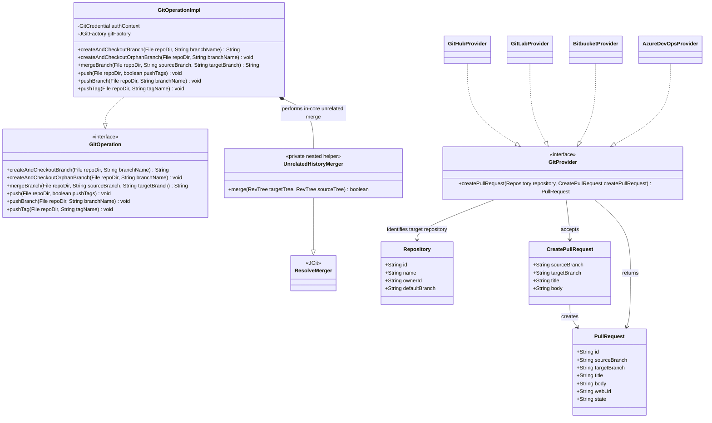

# Create Local Branch, Pure Orphan Merge, Selective Push, and Pull Request Support

## Requirements

Implement additive Git utilities that let consumers create and check out collision-safe regular or orphan branches, integrate a pure orphan commit into an existing branch while preserving unrelated files, selectively publish one named branch or one named tag, and create a same-repository Pull Request or Merge Request through every supported Git provider without coupling provider collaboration APIs to local Git transport.

- Add `String createAndCheckoutBranch(File repoDir, String branchName)` to `GitOperation`.
- Start the branch strictly from current `HEAD`, including detached HEAD after tag or commit checkout.
- Refuse branch creation when `refs/heads/{branchName}` exists locally or on `origin`; check the remote with authenticated JGit `ls-remote`.
- Return the full SHA addressed by `HEAD` after branch creation and checkout.
- Keep the existing `push(File repoDir, boolean pushTags)` contract and implementation intact, including its existing all-branches behavior and optional all-tags behavior.
- Add `void pushBranch(File repoDir, String branchName)` to selectively publish exactly one named local branch to the same branch ref on `origin`, without force-pushing.
- Add `void pushTag(File repoDir, String tagName)` to selectively publish exactly one named local tag to the same tag ref on `origin`, without pushing branches or other tags.
- Add `void createAndCheckoutOrphanBranch(File repoDir, String branchName)` to create an unborn orphan branch with an empty index and empty work tree, preserving only repository metadata.
- Add `String mergeBranch(File repoDir, String sourceBranch, String targetBranch)` to merge a local source branch into a local target branch, including unrelated histories produced by orphan commits, and return the resulting target tip SHA.
- When the target branch is missing or unborn (no resolved tip) and the source branch has a commit tip, tip-promote: point the target ref at the source tip, check out the target, and return that SHA without creating a merge commit.
- When the target already has a tip, keep related/unrelated merge behavior; never tip-promote over an existing target tip.
- On merge conflict or failure after mutation starts when a pre-merge target tip existed, restore the target branch to its pre-merge tip and leave a clean work tree.
- Add `PullRequest createPullRequest(Repository repository, CreatePullRequest createPullRequest)` to `GitProvider`.
- Use two explicit shared DTOs: `CreatePullRequest` for create input and `PullRequest` for create result (do not reuse one model for both).
- Implement Pull Request or Merge Request creation for GitHub, GitLab, Bitbucket Cloud, and Azure DevOps in the first release.
- On `CreatePullRequest`, require `sourceBranch` and `title`; default a blank `targetBranch` to `repository.defaultBranch`; allow an optional body.
- On `PullRequest`, always return `id` and `webUrl`, plus normalized source branch, target branch, title, optional body, and provider state when available.
- Require callers to push the source branch before creating the Pull Request, normally through `pushBranch`; `createPullRequest` must not perform Git push, merge, or branch deletion.
- Limit v1 to same-repository, non-draft Pull Requests without reviewers, assignees, labels, or fork metadata.
- Preserve all existing `GitOperation` and `GitProvider` behavior and public contracts.

## Entities



- Use two explicit shared DTOs in `org.opendatamesh.platform.git.model`; do not overload a single `PullRequest` for both input and output.
- `CreatePullRequest` (request):
  - `sourceBranch`: required bare branch name.
  - `targetBranch`: optional bare branch name; resolved to `Repository.defaultBranch` when blank.
  - `title`: required.
  - `body`: optional.
  - Must not contain result-only fields (`id`, `webUrl`, `state`).
- `PullRequest` (response):
  - `id`: required provider PR number/id/iid represented as `String`.
  - `webUrl`: required browser URL.
  - `state`: optional provider state represented as `String` to avoid a lossy cross-provider enum.
  - `sourceBranch`, `targetBranch`, `title`, `body`: populated from the provider response or normalized request values.
  - Must not be used as the create method input type.
- Branch names in the domain remain bare names. Provider adapters add `refs/heads/` only where the provider API requires full refs.

## Approach

1. Local branch operation:
   - Open the supplied local repository with `JGitFactory.open`.
   - Validate the repository directory, branch name, configured `origin`, and Git credentials before mutation.
   - Normalize only a leading `refs/heads/` prefix; reject a resulting blank name, any other `refs/` namespace, and names for which `Repository.isValidRefName("refs/heads/" + name)` returns false.
   - Resolve `refs/heads/{name}` locally. If present, fail before any remote call or checkout.
   - Read the `origin` URL from the local repository configuration and execute `JGitFactory.lsRemoteRepository()` with the same credential provider used by clone and push.
   - Match the exact remote ref `refs/heads/{name}`. If present, fail without creating the local branch.
   - Create the branch at current `HEAD`, check it out, resolve `HEAD`, and return its full object id.
   - Wrap I/O and JGit errors in `GitOperationException("createAndCheckoutBranch", ...)`.

2. Selective push operations:
   - Preserve `push(File repoDir, boolean pushTags)` exactly as it existed before this feature; do not change its use of `setPushAll()`, its optional `setPushTags()`, validation, exception behavior, or tests except where compilation requires acknowledging the additive methods.
   - `pushBranch` normalizes only a leading `refs/heads/` prefix, verifies that the exact local branch ref exists, and pushes the explicit non-force refspec `refs/heads/{name}:refs/heads/{name}` to `origin`.
   - `pushTag` normalizes only a leading `refs/tags/` prefix, verifies that the exact local tag ref exists, and pushes the explicit non-force refspec `refs/tags/{name}:refs/tags/{name}` to `origin`.
   - Neither selective operation depends on the currently checked-out ref; `pushBranch` may publish a named branch while HEAD is attached elsewhere or detached.
   - Each selective operation inspects its matching `RemoteRefUpdate` and treats rejected/non-successful statuses as `GitOperationException`; a completed `PushCommand.call()` alone is not sufficient proof of success.
   - `pushBranch` must not push tags or any other branch. `pushTag` must not push branches or any other tag.

3. Pure orphan branch:
   - Validate the repository, normalized branch name, configured `origin`, and credentials before mutation.
   - Require `RepositoryState.SAFE`, `Status.isClean()`, and an empty `Status.getIgnoredNotInIndex()` before mutation.
   - Refuse when the exact branch is the current unborn branch, resolves locally, exists as an exact local ref, or exists on `origin`; use authenticated `ls-remote` for the remote check.
   - Create and check out an orphan branch with no parent history.
   - Replace the locked `DirCache` with an empty committed index, then delete every work-tree entry except `.git` and the repository metadata path. `Files.walk` is used without following symbolic links.
   - Leave an unborn branch with unresolved `HEAD`; the method returns no SHA because no orphan commit exists yet.
   - The next consumer-created commit must have zero parents.
   - Verify the symbolic branch, unresolved `HEAD`, zero-entry index, and metadata-only work tree directly after cleanup. On failure, force-checkout and hard-reset the original branch/tip, remove any partial orphan ref, and retain rollback failures as suppressed exceptions.

4. Local branch merge:
   - Validate that the repository is clean and the exact local **source** branch resolves to a non-null tip before checkout or merge. Reject missing or unborn **source** refs.
   - Resolve the **target** branch: if it has a non-null tip, proceed with merge; if it is missing as a local ref or is unborn (no object id), perform **tip promotion** instead of a merge.
   - Tip promotion: create or update `refs/heads/{target}` to the source tip object id (`RefUpdate`), force-check out the target branch, leave a clean work tree matching that tip, and return the source tip SHA. Do not create a merge commit. Do not tip-promote when the target already has a tip. On tip-promotion failure after mutation starts, force-delete the promoted target ref when present and clear merge metadata (no pre-merge tip to hard-reset).
   - When the target already has a tip: check out the target branch and merge the source branch into it without squash or rebase.
   - Return the existing target tip without creating a commit when source and target already identify the same commit.
   - Detect whether histories are related with a `RevWalk` configured with `RevFilter.MERGE_BASE`.
   - Support unrelated histories by treating the empty tree as the merge base when no common ancestor exists. Target-only files and source-only files are both retained; conflicting additions or edits to the same paths are reported as conflicts.
   - For unrelated histories, use an in-core private `ResolveMerger` subclass with `EmptyTreeIterator`, check out its result through `DirCacheCheckout`, write merge message/head metadata, and create the commit through JGit.
   - A successful unrelated-history merge creates a merge commit whose first parent is the pre-merge target tip and whose second parent is the source tip.
   - Use the deterministic message `Merge branch '<source>' into '<target>'`; author/committer identity follows repository configuration.
   - Return the full SHA of the target tip after success (merge tip or promoted tip). Leave the target branch checked out.
   - On conflict or any failure after mutation starts when a pre-merge target tip existed, ensure the target is checked out before hard-resetting it to its pre-merge tip, clear merge message/head metadata, restore a clean work tree, and throw `GitOperationException("mergeBranch", ...)`. Preserve rollback failures as suppressed exceptions.
   - Do not push, tag, delete either branch, or invoke provider APIs.

5. Provider-neutral Pull Request API:
   - Add shared `CreatePullRequest` (request) and `PullRequest` (response) models, and `createPullRequest(Repository, CreatePullRequest)` on `GitProvider`.
   - In each provider, validate repository, source branch, and title from `CreatePullRequest`; resolve target branch from the request or repository default; reject blank resolved target and identical source/target before HTTP.
   - Map `CreatePullRequest` → provider HTTP request, then provider HTTP response → `PullRequest`.
   - Follow the existing provider operation pattern: provider-specific request/response POJOs, static mapper, `RestTemplate.exchange`, credential headers, and existing exception translation.
   - Do not query for duplicate Pull Requests before creation. Let the provider return its native conflict/validation response and preserve it through `GitClientException`.

6. Provider mappings:
   - GitHub: `head`, `base`, `title`, optional `body`; return `number`, `html_url`, and `state`.
   - GitLab: `source_branch`, `target_branch`, `title`, optional `description`; return `iid`, `web_url`, and `state`.
   - Bitbucket: nested `source.branch.name`, `destination.branch.name`, `title`, optional `description`; return `id`, `links.html.href`, and `state`.
   - Azure DevOps: `sourceRefName`, `targetRefName`, `title`, optional `description`; add `refs/heads/` to bare names and return `pullRequestId`, `_links.web.href`, and `status`.

7. Error strategy:
   - Use `GitOperationException` for repository validation, local/remote ref collisions, ls-remote failures, checkout failures, orphan cleanup failures, dirty merge preconditions, missing or unborn merge **source** refs, merge conflicts/rollback failures, tip-promotion failures, invalid or missing selective refs, and rejected selective pushes.
   - Use `IllegalArgumentException` for invalid provider method inputs, matching current provider precondition conventions.
   - Translate HTTP 401 to `GitProviderAuthenticationException`, other HTTP responses to `GitClientException(status, responseBody)`, and transport/client failures to `GitClientException(500, message)`.
   - This library does not define a global REST exception handler; consuming applications retain responsibility for HTTP response mapping.

## Structure

### Interface and Implementation Relationships

1. `GitOperationImpl` implements the extended `GitOperation` interface.
2. `GitHubProvider`, `GitLabProvider`, `BitbucketProvider`, and `AzureDevOpsProvider` implement the extended `GitProvider` interface.
3. `CreatePullRequest` and `PullRequest` are shared models beside `Repository`, `Branch`, `Commit`, and `Tag`.
4. Existing exceptions remain unchanged; no new exception hierarchy is required.

### Dependencies

1. `GitOperationImpl.createAndCheckoutBranch` depends on `JGitFactory.open`, `JGitFactory.lsRemoteRepository`, local repository config, and the existing credential builder.
2. `GitOperationImpl.createAndCheckoutOrphanBranch` depends on exact local/remote ref checks, `RepositoryState`/`Status`, orphan checkout, locked `DirCache` replacement, metadata-preserving NIO cleanup, and forced checkout/hard-reset rollback.
3. `GitOperationImpl.mergeBranch` depends on exact local source tip resolution, optional target tip resolution (`resolveLocalBranchTip`: born vs missing/unborn), `RepositoryState`/`Status`, tip promotion (`tipPromoteTarget` / `rollbackTipPromotion`) via local `RefUpdate` plus forced checkout when the target has no tip, `RevWalk` merge-base detection, standard JGit merge for related histories, and a private in-core `ResolveMerger` subclass plus `EmptyTreeIterator` and `DirCacheCheckout` for unrelated histories.
4. Existing `GitOperationImpl.push` remains unchanged. `GitOperationImpl.pushBranch` and `GitOperationImpl.pushTag` depend on exact local ref resolution, explicit JGit `RefSpec` values, and push-result inspection.
5. Each provider `createPullRequest` depends on its credential, `RestTemplate`, provider-specific request/response classes, and mapper.
6. GitHub resolves the owner login through its existing `getOwnerName(Repository)` path.
7. GitLab uses `Repository.id` as the project id.
8. Bitbucket uses `Repository.ownerId` as workspace and `Repository.name` as repository slug.
9. Azure DevOps uses `Repository.ownerId` as project id and `Repository.id` as repository id.

### Package Layout

1. Shared models:
   - `src/main/java/org/opendatamesh/platform/git/model/CreatePullRequest.java`
   - `src/main/java/org/opendatamesh/platform/git/model/PullRequest.java`
2. Local Git API:
   - `src/main/java/org/opendatamesh/platform/git/git/GitOperation.java`
   - `src/main/java/org/opendatamesh/platform/git/git/GitOperationImpl.java`
3. Provider abstraction:
   - `src/main/java/org/opendatamesh/platform/git/provider/GitProvider.java`
4. GitHub resources:
   - `provider/github/resources/createpullrequest/GitHubCreatePullRequestReq.java`
   - `provider/github/resources/createpullrequest/GitHubCreatePullRequestRes.java`
   - `provider/github/resources/createpullrequest/GitHubCreatePullRequestMapper.java`
5. GitLab resources:
   - `provider/gitlab/resources/createmergerequest/GitLabCreateMergeRequestReq.java`
   - `provider/gitlab/resources/createmergerequest/GitLabCreateMergeRequestRes.java`
   - `provider/gitlab/resources/createmergerequest/GitLabCreateMergeRequestMapper.java`
6. Bitbucket resources:
   - `provider/bitbucket/resources/createpullrequest/BitbucketCreatePullRequestReq.java`
   - `provider/bitbucket/resources/createpullrequest/BitbucketCreatePullRequestRes.java`
   - `provider/bitbucket/resources/createpullrequest/BitbucketCreatePullRequestMapper.java`
7. Azure resources:
   - `provider/azure/resources/createpullrequest/AzureCreatePullRequestReq.java`
   - `provider/azure/resources/createpullrequest/AzureCreatePullRequestRes.java`
   - `provider/azure/resources/createpullrequest/AzureCreatePullRequestMapper.java`
8. Tests remain in the existing Git and provider test classes, with provider response fixtures under the corresponding `src/test/resources/{provider}` directory.

## Operations

### Create Domain Model — CreatePullRequest

1. Responsibility: explicit create-input DTO for same-repository PR/MR creation.
2. Attributes:
   - `sourceBranch: String` — required bare source branch.
   - `targetBranch: String` — optional; resolved to `Repository.defaultBranch` when blank.
   - `title: String` — required.
   - `body: String` — optional description.
3. API:
   - Public no-argument constructor.
   - Standard getters and setters for every field.
   - Optionally add a convenience constructor for the four create fields if consistent with nearby models.
4. Constraints:
   - Request-only: must not include `id`, `webUrl`, or `state`.
   - Keep it provider-neutral; no provider-specific annotations or nested API payload types.
   - Do not add draft, reviewers, labels, assignees, merge settings, or fork metadata.

### Create Domain Model — PullRequest

1. Responsibility: explicit create-result DTO returned by `createPullRequest`.
2. Attributes:
   - `id: String` — required provider PR number/id/iid as string.
   - `sourceBranch: String` — normalized bare source branch.
   - `targetBranch: String` — normalized bare target branch.
   - `title: String` — PR title.
   - `body: String` — optional description when returned/known.
   - `webUrl: String` — required browser URL.
   - `state: String` — optional provider state.
3. API:
   - Public no-argument constructor.
   - Standard getters and setters for every field.
4. Constraints:
   - Response-only: must not be accepted as the `createPullRequest` input type.
   - Keep it provider-neutral; no provider-specific annotations or nested API payload types.
   - Do not add draft, reviewers, labels, assignees, merge settings, or fork metadata.

### Extend Local Git Contract — GitOperation

1. Add:
   - `String createAndCheckoutBranch(File repoDir, String branchName)`
   - `void createAndCheckoutOrphanBranch(File repoDir, String branchName)`
   - `String mergeBranch(File repoDir, String sourceBranch, String targetBranch)`
   - `void pushBranch(File repoDir, String branchName)`
   - `void pushTag(File repoDir, String tagName)`
2. Javadoc contract:
   - Starts at current `HEAD`.
   - Checks exact local and `origin` branch refs.
   - Returns full HEAD SHA after checkout.
   - Never overwrites or force-updates a ref.
   - Throws `GitOperationException` for invalid input, collision, remote-check failure, or JGit failure.
3. Selective push Javadoc contracts:
   - `pushBranch` publishes only the named local branch to the same branch name on `origin`.
   - `pushTag` publishes only the named local tag to the same tag name on `origin`.
   - Both methods use non-force refspecs and throw `GitOperationException` for invalid input, missing local refs, JGit failures, or rejected remote updates.
4. Compatibility:
   - Do not modify the signature, Javadoc contract, implementation behavior, or tests of `push(File repoDir, boolean pushTags)`.
5. Orphan and merge Javadoc contracts:
   - `createAndCheckoutOrphanBranch` creates an unborn orphan branch with an empty index/work tree and no parent history; it returns `void` because no commit SHA exists yet.
   - `mergeBranch` merges the exact local source branch into the local target branch when the target has a tip (including unrelated histories), tip-promotes the target to the source tip when the target is missing or unborn, returns the target tip SHA, and rolls back to a clean pre-merge target on conflict/failure when a pre-merge tip existed.
   - Neither operation pushes, tags, deletes branches, or calls provider APIs.

### Implement Local Branch Creation — GitOperationImpl

1. Validate `repoDir` exists and `branchName` has text.
2. Open the repository through `gitFactory.open(repoDir)`.
3. Normalize `branchName` to a bare branch and derive `refs/heads/{name}`.
4. Resolve the local full ref; throw `GitOperationException("createAndCheckoutBranch", "Branch already exists locally: ...")` when found.
5. Obtain `remote.origin.url` from repository config; reject missing/blank configuration.
6. Call `gitFactory.lsRemoteRepository()` with:
   - `.setRemote(originUrl)`
   - `.setCredentialsProvider(buildCredentialsProvider(authContext))`
7. Search returned refs for exact equality with `refs/heads/{name}`; throw a remote-collision `GitOperationException` when found.
8. Execute `git.branchCreate().setName(name).call()`, then `git.checkout().setName(name).call()`.
9. Resolve `HEAD`; fail if unresolved; return `ObjectId.getName()`.
10. Preserve existing `GitOperationException` instances; wrap `IOException` and `GitAPIException` with operation name and cause.

### Implement Pure Orphan Branch Creation — GitOperationImpl

1. Method `createAndCheckoutOrphanBranch(File repoDir, String branchName)` returns `void`.
2. Validate that `repoDir` is a directory and `branchName` has text before opening or mutating Git.
3. Trim the name, normalize one leading `refs/heads/` prefix, reject other `refs/` namespaces, and require `Repository.isValidRefName` for the resulting full local ref.
4. Open the repository and reject `refs/heads/{name}` when it is the current unborn branch, an exact local ref, or resolves locally; throw `GitOperationException("createAndCheckoutOrphanBranch", "Branch already exists locally: ...")` when found.
5. Obtain `remote.origin.url`; reject missing/blank configuration.
6. Execute authenticated `ls-remote` and refuse an exact `refs/heads/{name}` match on `origin`.
7. Require `RepositoryState.SAFE`, `Status.isClean()`, and no `getIgnoredNotInIndex()` entries before mutation. Do not discard pending caller files.
8. Check out the normalized branch with orphan semantics.
9. Lock the `DirCache`, clear/write/commit it, and unlock it when commit fails. Recursively delete all entries under the work-tree root except a `.git` file/directory and any path containing the external repository metadata directory; `Files.walk` must not follow symbolic links.
10. Verify after cleanup:
    - `HEAD` is symbolic to `refs/heads/{name}` but does not resolve to an object id.
    - The index contains zero entries and the work tree contains only preserved repository metadata.
11. Preserve existing `GitOperationException` instances; wrap I/O and JGit failures with operation `createAndCheckoutOrphanBranch`.
12. If failure occurs after mutation starts, force-checkout the original local branch (or detached commit), hard-reset it to the captured original tip, restore the original clean work tree, and force-delete a partially created orphan ref when present. Attach rollback failure as a suppressed exception on the original failure.

### Implement Local Branch Merge — GitOperationImpl

1. Method `mergeBranch(File repoDir, String sourceBranch, String targetBranch)` returns the full SHA of the target tip after a successful merge or tip promotion.
2. Validate that `repoDir` is a directory; trim source and target names, normalize one leading `refs/heads/` prefix on each, reject other `refs/` namespaces, and validate both full refs with `Repository.isValidRefName`.
3. Reject identical source and target names.
4. Open the repository, require `RepositoryState.SAFE`, `Status.isClean()`, and no ignored entries.
5. Resolve the exact local **source** ref to a non-null object id. Reject missing or unborn source before mutation.
6. Resolve the exact local **target** ref via `resolveLocalBranchTip` (null tip means missing or unborn):
   - If the target tip is a non-null object id, capture it as the pre-merge target tip and continue with merge steps below.
   - If the target is missing or unborn (no object id), perform **tip promotion** via `tipPromoteTarget` and return:
     - Force-update `refs/heads/{target}` to the source tip object id (`RefUpdate` accepting `NEW`, `FORCED`, `FAST_FORWARD`, or `NO_CHANGE`); do not create a merge commit.
     - Force-checkout the target branch so HEAD and the work tree match that tip.
     - Require a clean work tree after checkout and verify the target tip equals the source tip.
     - Return the source tip SHA (which is now the target tip).
     - On failure after tip-promotion mutation starts: `rollbackTipPromotion` force-deletes the target branch ref when present, clears merge message/heads metadata, and attaches rollback failures as suppressed exceptions. Tip-promotion rollback does **not** hard-reset to a pre-merge tip (none existed).
7. When the target already had a tip: check out the target branch.
8. Recheck pristine state after checkout. If source and target tips are equal, return the unchanged target SHA; otherwise perform a non-squash, non-rebase merge:
   - Detect a common ancestor with `RevWalk` and `RevFilter.MERGE_BASE`.
   - When a common ancestor exists, call the standard JGit `MergeCommand` with the exact source ref and deterministic message, and require a successful merge status.
   - When histories are unrelated, use an in-core private `ResolveMerger` subclass and `EmptyTreeIterator` as the synthetic merge base.
   - Preserve target-only and source-only paths.
   - Treat incompatible changes to the same path, including add/add differences, as conflicts.
9. On a successful unrelated-history merge, create a commit with:
   - Checkout: apply the in-core result tree with `DirCacheCheckout` and conflict failure enabled.
   - Merge metadata: write the deterministic merge message and source tip as merge head before committing.
   - Tree: merged result.
   - First parent: pre-merge target tip.
   - Second parent: source tip.
   - Message: `Merge branch '<source>' into '<target>'`.
   - Author/committer: repository-configured identity.
10. On success of a born-target merge, resolve the exact target ref, verify an unrelated-history commit advanced that ref to the returned commit when applicable, and return its full SHA with target still checked out.
11. On conflict or failure after mutation starts when a pre-merge target tip existed:
    - Force-checkout target first when it is not current, so rollback cannot reset another branch.
    - Hard-reset target to the captured pre-merge target tip.
    - Remove merge metadata/state and conflict entries.
    - Verify the work tree is clean.
    - Throw `GitOperationException("mergeBranch", ...)`; include unrelated-history unmerged paths when available and attach rollback failures as suppressed exceptions.
12. Do not push, tag, delete source/target branches, or invoke provider HTTP APIs.
13. Never tip-promote when the target already has a tip; never use tip promotion to overwrite or hard-reset an existing target commit.

### Implement Selective Push — GitOperationImpl

1. Keep `push(File repoDir, boolean pushTags)` intact:
   - Retain the existing `setPushAll()` call.
   - Retain the optional `setPushTags()` call when `pushTags` is true.
   - Do not add current-branch resolution, detached-HEAD rejection, explicit refspecs, or remote-update inspection to this existing method.
2. Implement `pushBranch(File repoDir, String branchName)`:
   - Validate that `repoDir` exists and `branchName` has text.
   - Normalize one leading `refs/heads/` prefix and reject a blank normalized name.
   - Open the repository and resolve the exact local ref `refs/heads/{name}`; fail before push when it does not exist.
   - Build a push command for `origin` with existing credentials and exactly one non-force refspec, `refs/heads/{name}:refs/heads/{name}`.
   - Do not call `setPushAll()` or `setPushTags()`.
   - Inspect the matching remote update; accept `OK` and `UP_TO_DATE`, and throw `GitOperationException("pushBranch", ...)` for rejected or unsuccessful statuses.
3. Implement `pushTag(File repoDir, String tagName)`:
   - Validate that `repoDir` exists and `tagName` has text.
   - Normalize one leading `refs/tags/` prefix and reject a blank normalized name.
   - Open the repository and resolve the exact local ref `refs/tags/{name}`; fail before push when it does not exist.
   - Build a push command for `origin` with existing credentials and exactly one non-force refspec, `refs/tags/{name}:refs/tags/{name}`.
   - Do not call `setPushAll()` or `setPushTags()`.
   - Inspect the matching remote update; accept `OK` and `UP_TO_DATE`, and throw `GitOperationException("pushTag", ...)` for rejected or unsuccessful statuses.
4. Add real-JGit integration-style tests with a local bare remote proving that `pushBranch` publishes only the selected branch and `pushTag` publishes only the selected tag.

### Extend Provider Contract — GitProvider

1. Add:
   - `PullRequest createPullRequest(Repository repository, CreatePullRequest createPullRequest)`
2. Javadoc:
   - Same-repository only.
   - Caller must have already pushed source branch.
   - Target defaults to repository default when omitted on `CreatePullRequest`.
   - No push, merge, or branch cleanup side effects.
   - Accepts `CreatePullRequest` input and returns populated `PullRequest` result, or throws existing provider exceptions.
3. Keep the method abstract and implement it in all four built-in providers in the same release.

### Implement GitHub Pull Request Creation

1. Add provider request, response, and mapper classes in `github/resources/createpullrequest`.
2. Request mapping:
   - `sourceBranch → head`
   - resolved `targetBranch → base`
   - `title → title`
   - `body → body` when non-blank
3. Response mapping:
   - `number → id` using string conversion
   - `html_url → webUrl`
   - `state → state`
4. Provider method:
   - Validate and resolve target.
   - Resolve owner login using existing `getOwnerName(repository)`.
   - POST `{baseUrl}/repos/{owner}/{repo}/pulls`.
   - Reuse existing headers and exception translation.

### Implement GitLab Merge Request Creation

1. Add request, response, and mapper classes in `gitlab/resources/createmergerequest`.
2. Request mapping:
   - `sourceBranch → source_branch`
   - resolved `targetBranch → target_branch`
   - `title → title`
   - `body → description`
3. Response mapping:
   - Prefer `iid → id` for the project-scoped user-facing identifier.
   - `web_url → webUrl`
   - `state → state`
4. POST `{baseUrl}/api/v4/projects/{repository.id}/merge_requests`.

### Implement Bitbucket Pull Request Creation

1. Add request, response, nested link/branch payload types, and mapper in `bitbucket/resources/createpullrequest`; keep nested POJOs only where required by Bitbucket JSON.
2. Request mapping:
   - `sourceBranch → source.branch.name`
   - resolved `targetBranch → destination.branch.name`
   - `title → title`
   - `body → description`
3. Response mapping:
   - `id → id`
   - `links.html.href → webUrl`
   - `state → state`
4. POST `{baseUrl}/repositories/{repository.ownerId}/{repository.name}/pullrequests`.

### Implement Azure DevOps Pull Request Creation

1. Add request, response, link payload types, and mapper in `azure/resources/createpullrequest`.
2. Request mapping:
   - `sourceBranch → sourceRefName` with one `refs/heads/` prefix.
   - resolved `targetBranch → targetRefName` with one `refs/heads/` prefix.
   - `title → title`
   - `body → description`
3. Response mapping:
   - `pullRequestId → id`
   - `_links.web.href → webUrl`
   - `status → state`
4. POST `{baseUrl}/{repository.ownerId}/_apis/git/repositories/{repository.id}/pullrequests?api-version=7.1`.

### Gherkin Acceptance Scenarios

Every scenario below is executable acceptance criteria. Each scenario must be implemented by one test function (or, for a `Scenario Outline`, one parameterized test or one test per example). Copy the complete Gherkin scenario, including its scenario ID, verbatim into a Java block comment immediately above the corresponding `@Test` / `@ParameterizedTest` annotation.

```gherkin
Feature: Create and check out a local branch from current HEAD

  Scenario: BR-001 Create a branch from an attached HEAD
    Given a valid local repository whose current branch points to commit "C1"
    And branch "update-v2" does not exist locally
    And "git ls-remote origin refs/heads/update-v2" returns no matching ref
    When createAndCheckoutBranch is called for "update-v2"
    Then local branch "update-v2" is created at commit "C1"
    And "update-v2" is checked out
    And the returned SHA is the full SHA of commit "C1"

  Scenario: BR-002 Create a branch from a detached HEAD
    Given a valid local repository with detached HEAD at commit "C1"
    And branch "update-v2" does not exist locally or on origin
    When createAndCheckoutBranch is called for "update-v2"
    Then local branch "update-v2" is created at commit "C1"
    And "update-v2" is checked out
    And the returned SHA is the full SHA of commit "C1"

  Scenario: BR-003 Refuse a branch name that exists locally
    Given a valid local repository
    And local branch "update-v2" already exists
    When createAndCheckoutBranch is called for "update-v2"
    Then a GitOperationException with operation "createAndCheckoutBranch" is thrown
    And git ls-remote is not called
    And no branch is created or checked out

  Scenario: BR-004 Refuse a branch name that exists on origin
    Given a valid local repository without local branch "update-v2"
    And "git ls-remote origin refs/heads/update-v2" returns that exact remote ref
    When createAndCheckoutBranch is called for "update-v2"
    Then a GitOperationException with operation "createAndCheckoutBranch" is thrown
    And no branch is created or checked out

  Scenario: BR-005 Surface a remote existence check failure
    Given a valid local repository without local branch "update-v2"
    And authenticated git ls-remote fails
    When createAndCheckoutBranch is called for "update-v2"
    Then a GitOperationException with operation "createAndCheckoutBranch" wraps the failure
    And no branch is created or checked out

  Scenario Outline: BR-006 Reject invalid branch creation input
    Given <repository condition>
    And the requested branch name is <branch name>
    When createAndCheckoutBranch is called
    Then a GitOperationException with operation "createAndCheckoutBranch" is thrown
    And no Git mutation is attempted

    Examples:
      | repository condition                    | branch name |
      | the repository directory is null        | "update-v2" |
      | the repository directory does not exist | "update-v2" |
      | the repository directory is valid       | blank       |
      | the repository has no origin URL         | "update-v2" |
```

```gherkin
Feature: Create a pure orphan branch

  Scenario: ORPH-001 Create an empty unborn orphan branch from a non-empty repository
    Given a clean repository on branch "main" with committed files
    And branch "pure-v1" does not exist locally or on origin
    When createAndCheckoutOrphanBranch is called for "pure-v1"
    Then HEAD is symbolic to "refs/heads/pure-v1" and does not resolve to a commit
    And the index and work tree contain no entries
    And the repository metadata directory is preserved
    And the first commit subsequently created on "pure-v1" has zero parents

  Scenario: ORPH-002 Refuse an orphan branch name that exists locally
    Given a clean local repository
    And local branch "pure-v1" already exists
    When createAndCheckoutOrphanBranch is called for "pure-v1"
    Then a GitOperationException with operation "createAndCheckoutOrphanBranch" is thrown
    And git ls-remote is not called
    And the current branch, index, and work tree are unchanged

  Scenario: ORPH-003 Refuse an orphan branch name that exists on origin
    Given a clean local repository without local branch "pure-v1"
    And "git ls-remote origin refs/heads/pure-v1" returns that exact remote ref
    When createAndCheckoutOrphanBranch is called for "pure-v1"
    Then a GitOperationException with operation "createAndCheckoutOrphanBranch" is thrown
    And no orphan checkout or work-tree cleanup is attempted

  Scenario: ORPH-004 Surface an orphan remote existence check failure
    Given a clean local repository without local branch "pure-v1"
    And authenticated git ls-remote fails
    When createAndCheckoutOrphanBranch is called for "pure-v1"
    Then a GitOperationException with operation "createAndCheckoutOrphanBranch" wraps the failure
    And no orphan checkout or work-tree cleanup is attempted

  Scenario Outline: ORPH-005 Refuse a non-pristine work tree
    Given a valid local repository with <work-tree condition>
    When createAndCheckoutOrphanBranch is called for "pure-v1"
    Then a GitOperationException with operation "createAndCheckoutOrphanBranch" is thrown
    And no file is deleted
    And no orphan checkout is attempted

    Examples:
      | work-tree condition |
      | modified tracked files |
      | staged changes |
      | untracked files |
      | ignored files |
      | unresolved conflicts |

  Scenario Outline: ORPH-006 Reject invalid orphan creation input
    Given <repository condition>
    And the requested orphan branch name is <branch name>
    When createAndCheckoutOrphanBranch is called
    Then a GitOperationException with operation "createAndCheckoutOrphanBranch" is thrown
    And no Git mutation is attempted

    Examples:
      | repository condition                    | branch name |
      | the repository directory is null        | "pure-v1"   |
      | the repository directory does not exist | "pure-v1"   |
      | the repository directory is valid       | blank       |
      | the repository has no origin URL         | "pure-v1"   |

  Scenario: ORPH-007 Restore the original branch after an orphan cleanup failure
    Given a clean repository on branch "main" at commit "M1"
    And orphan checkout for "pure-v1" succeeds
    And clearing the index or work tree fails
    When createAndCheckoutOrphanBranch is called for "pure-v1"
    Then a GitOperationException with operation "createAndCheckoutOrphanBranch" is thrown
    And "main" is checked out at commit "M1"
    And the original committed work tree is restored and clean
    And the partial orphan ref is removed
```

```gherkin
Feature: Merge local branches including unrelated orphan history

  Scenario: MERGE-001 Merge unrelated histories while preserving target-only and source-only files
    Given target branch "main" at commit "M1" contains "user.txt"
    And orphan source branch "pure-v1" at commit "P1" contains "generated.txt"
    And the repository work tree is clean
    When mergeBranch merges "pure-v1" into "main"
    Then "main" remains checked out
    And the result contains both "user.txt" and "generated.txt"
    And the returned SHA is the full SHA of a merge commit
    And that merge commit has first parent "M1" and second parent "P1"
    And neither branch is pushed or deleted

  Scenario: MERGE-002 Roll back a conflicting unrelated-history merge
    Given target branch "main" and orphan source branch "pure-v1" add different content at the same path
    And "main" points to commit "M1" before the merge
    When mergeBranch merges "pure-v1" into "main"
    Then a GitOperationException with operation "mergeBranch" identifies the conflict
    And "main" remains at commit "M1"
    And "main" is checked out with a clean work tree
    And no merge metadata or conflict entries remain

  Scenario: MERGE-003 Use normal merge semantics for related histories
    Given source branch "feature" and target branch "main" share a common ancestor
    And the repository work tree is clean
    When mergeBranch merges "feature" into "main"
    Then the merge uses standard non-squash non-rebase Git semantics
    And the returned SHA equals the resulting "main" tip
    And "main" remains checked out

  Scenario Outline: MERGE-004 Reject invalid merge input before mutation
    Given <merge condition>
    When mergeBranch is called
    Then a GitOperationException with operation "mergeBranch" is thrown
    And no checkout or merge mutation is attempted

    Examples:
      | merge condition |
      | the repository directory is null |
      | the repository directory does not exist |
      | sourceBranch is blank |
      | targetBranch is blank |
      | sourceBranch equals targetBranch |
      | the local source branch does not exist |
      | the local source branch is unborn |
      | the work tree is not pristine |

  Scenario: MERGE-005 Merge does not perform remote or provider side effects
    Given valid local source and target branches
    When mergeBranch succeeds
    Then no Git push is performed
    And no tag is created
    And no branch is deleted
    And no provider HTTP API is called

  Scenario: MERGE-006 Tip-promote when the target branch is missing or unborn
    Given orphan source branch "pure-v1" at commit "P1" containing "generated.txt"
    And target branch "main" has no resolved tip
    And the repository work tree is clean
    When mergeBranch merges "pure-v1" into "main"
    Then "main" is checked out at commit "P1"
    And the returned SHA equals the full SHA of "P1"
    And "main" contains "generated.txt"
    And no merge commit is created
    And neither branch is pushed or deleted
```

```gherkin
Feature: Compose a pure checkpoint and integration merge

  Scenario: FLOW-001 Tag the pure commit and merge it into a branch with existing files
    Given branch "main" contains committed file "user.txt"
    And orphan branch "pure-v1" contains only committed file "generated.txt"
    When the pure commit is tagged "checkpoint-v1"
    And mergeBranch merges "pure-v1" into "main"
    Then tag "checkpoint-v1" still points to the pure commit containing only "generated.txt"
    And "main" contains both "user.txt" and "generated.txt"
    And the orphan branch has not been pushed

  Scenario: FLOW-002 Tag the pure commit and tip-promote into an empty integration branch
    Given target branch "main" has no resolved tip
    And orphan branch "pure-v1" contains only committed file "generated.txt"
    When the pure commit is tagged "checkpoint-v1"
    And mergeBranch merges "pure-v1" into "main"
    Then tag "checkpoint-v1" still points to the pure commit containing only "generated.txt"
    And "main" is checked out at that pure commit
    And "main" contains only "generated.txt"
    And no merge commit is created
    And the orphan branch has not been pushed
```

```gherkin
Feature: Preserve legacy push and selectively push named refs

  Scenario: PUSH-001 Preserve legacy branch push behavior
    Given a valid local repository
    When push is called with pushTags false
    Then the existing push-all-branches behavior is used
    And tags are not pushed
    And no selective refspec is configured

  Scenario: PUSH-002 Preserve legacy optional tag push behavior
    Given a valid local repository
    When push is called with pushTags true
    Then the existing push-all-branches behavior is used
    And the existing push-all-tags behavior is also used
    And no selective refspec is configured

  Scenario: PUSH-003 Selectively publish one named branch
    Given a valid local repository containing branches "main" and "update-v2"
    And HEAD is not required to point to "update-v2"
    When pushBranch is called for "update-v2"
    Then exactly one non-force refspec pushes "refs/heads/update-v2" to "refs/heads/update-v2" on origin
    And "main" is not pushed
    And no tags are pushed
    And the matching remote update is successful or up to date

  Scenario: PUSH-004 Surface a rejected selective branch update
    Given a valid local repository containing branch "update-v2"
    And origin rejects "refs/heads/update-v2" as non-fast-forward
    When pushBranch is called for "update-v2"
    Then a GitOperationException with operation "pushBranch" describes the rejected update
    And the rejection is not reported as success

  Scenario: PUSH-005 Publish only a selected branch to a real bare remote
    Given a real local repository connected to a real bare origin
    And local branches "main" and "update-v2" both have unpushed commits
    When pushBranch is called for "update-v2"
    Then origin contains "refs/heads/update-v2" at the local "update-v2" tip
    And the unpushed "main" commit is not published
    And no tag is published

  Scenario: PUSH-006 Selectively publish one named tag
    Given a valid local repository containing tags "checkpoint-v1" and "checkpoint-v2"
    When pushTag is called for "checkpoint-v2"
    Then exactly one non-force refspec pushes "refs/tags/checkpoint-v2" to "refs/tags/checkpoint-v2" on origin
    And "checkpoint-v1" is not pushed
    And no branch is pushed
    And the matching remote update is successful or up to date

  Scenario: PUSH-007 Surface a rejected selective tag update
    Given a valid local repository containing tag "checkpoint-v2"
    And origin rejects "refs/tags/checkpoint-v2"
    When pushTag is called for "checkpoint-v2"
    Then a GitOperationException with operation "pushTag" describes the rejected update
    And the rejection is not reported as success

  Scenario: PUSH-008 Publish only a selected tag to a real bare remote
    Given a real local repository connected to a real bare origin
    And local tags "checkpoint-v1" and "checkpoint-v2" are not on origin
    And a local branch has an unpushed commit
    When pushTag is called for "checkpoint-v2"
    Then origin contains "refs/tags/checkpoint-v2" at the local tag target
    And "refs/tags/checkpoint-v1" is absent from origin
    And the unpushed branch commit is not published

  Scenario Outline: PUSH-009 Reject invalid selective push input
    Given <repository condition>
    And the requested <ref type> name is <ref name>
    When the selective push method is called
    Then a GitOperationException with operation <operation> is thrown
    And no push command is executed

    Examples:
      | repository condition                    | ref type | ref name       | operation    |
      | the repository directory is null        | branch   | "update-v2"    | "pushBranch" |
      | the repository directory does not exist | branch   | "update-v2"    | "pushBranch" |
      | the repository directory is valid       | branch   | blank           | "pushBranch" |
      | the local branch does not exist          | branch   | "update-v2"    | "pushBranch" |
      | the repository directory is null        | tag      | "checkpoint-v2"| "pushTag"    |
      | the repository directory does not exist | tag      | "checkpoint-v2"| "pushTag"    |
      | the repository directory is valid       | tag      | blank           | "pushTag"    |
      | the local tag does not exist             | tag      | "checkpoint-v2"| "pushTag"    |
```

```gherkin
Feature: Create a same-repository Pull Request through each provider

  Scenario Outline: PR-001 Create a Pull Request with an explicit target branch
    Given a valid <provider> repository
    And a CreatePullRequest with source "update-v2", target "main", title "Update v2", and body "Generated update"
    And the source branch has already been pushed
    When createPullRequest is called
    Then the <provider> create Pull Request endpoint is called once with the expected authenticated POST request
    And the provider payload maps source, target, title, and body correctly
    And the returned PullRequest contains non-blank id and webUrl
    And the returned source branch, target branch, title, body, and state are mapped correctly
    And no Git push, merge, or branch deletion is performed

    Examples:
      | provider       |
      | GitHub         |
      | GitLab         |
      | Bitbucket      |
      | Azure DevOps   |

  Scenario Outline: PR-002 Default the target branch from the repository
    Given a valid <provider> repository whose default branch is "main"
    And a CreatePullRequest with source "update-v2", blank target, and title "Update v2"
    When createPullRequest is called
    Then the provider request uses "main" as the target branch
    And the returned PullRequest has target branch "main"

    Examples:
      | provider       |
      | GitHub         |
      | GitLab         |
      | Bitbucket      |
      | Azure DevOps   |

  Scenario Outline: PR-003 Reject invalid Pull Request input before HTTP
    Given a valid <provider> instance
    And <invalid input>
    When createPullRequest is called
    Then an IllegalArgumentException describing the invalid field is thrown
    And the provider HTTP API is not called

    Examples:
      | provider       | invalid input                                                   |
      | GitHub         | the repository is null                                          |
      | GitHub         | sourceBranch is blank                                           |
      | GitHub         | title is blank                                                  |
      | GitHub         | targetBranch is blank and repository.defaultBranch is blank     |
      | GitHub         | sourceBranch equals the resolved targetBranch                   |
      | GitLab         | the repository is null                                          |
      | GitLab         | sourceBranch is blank                                           |
      | GitLab         | title is blank                                                  |
      | GitLab         | targetBranch is blank and repository.defaultBranch is blank     |
      | GitLab         | sourceBranch equals the resolved targetBranch                   |
      | Bitbucket      | the repository is null                                          |
      | Bitbucket      | sourceBranch is blank                                           |
      | Bitbucket      | title is blank                                                  |
      | Bitbucket      | targetBranch is blank and repository.defaultBranch is blank     |
      | Bitbucket      | sourceBranch equals the resolved targetBranch                   |
      | Azure DevOps   | the repository is null                                          |
      | Azure DevOps   | sourceBranch is blank                                           |
      | Azure DevOps   | title is blank                                                  |
      | Azure DevOps   | targetBranch is blank and repository.defaultBranch is blank     |
      | Azure DevOps   | sourceBranch equals the resolved targetBranch                   |

  Scenario Outline: PR-004 Map provider authentication failure
    Given a valid <provider> repository and CreatePullRequest
    And the provider create Pull Request API returns HTTP 401
    When createPullRequest is called
    Then GitProviderAuthenticationException is thrown

    Examples:
      | provider       |
      | GitHub         |
      | GitLab         |
      | Bitbucket      |
      | Azure DevOps   |

  Scenario Outline: PR-005 Preserve provider HTTP errors
    Given a valid <provider> repository and CreatePullRequest
    And the provider create Pull Request API returns a non-401 error with status and response body
    When createPullRequest is called
    Then GitClientException preserves the provider status and response body

    Examples:
      | provider       |
      | GitHub         |
      | GitLab         |
      | Bitbucket      |
      | Azure DevOps   |
```

```gherkin
Feature: Keep Pull Request request and response DTOs explicit

  Scenario: DTO-001 CreatePullRequest exposes only create input fields
    When the public properties of CreatePullRequest are inspected
    Then sourceBranch, targetBranch, title, and body are present
    And id, webUrl, and state are absent

  Scenario: DTO-002 PullRequest exposes the normalized create result
    When the public properties of PullRequest are inspected
    Then id, sourceBranch, targetBranch, title, body, webUrl, and state are present
    And GitProvider.createPullRequest accepts CreatePullRequest and returns PullRequest
```

### Add Automated Tests

1. Traceability:
   - Implement every Gherkin scenario above with a test function; no scenario may remain documentation-only.
   - Use the scenario ID in the test name or its display name.
   - Copy the full scenario text verbatim as a Java block comment immediately above the corresponding `@Test` / `@ParameterizedTest`.

2. Extend `GitOperationImplTest`:
   - Implement `BR-001` through `BR-006`, `ORPH-001` through `ORPH-007`, `MERGE-001` through `MERGE-006`, `FLOW-001`, `FLOW-002`, and `PUSH-001` through `PUSH-009`.
   - A scenario outline may use a JUnit parameterized test only when each examples row is executed and identifiable in test reports.
   - Keep the pre-feature legacy push tests and expectations intact for `PUSH-001` and `PUSH-002`.
   - Use a real local repository and bare remote for `PUSH-005` and `PUSH-008`; mock JGit commands for focused interaction/error scenarios.
   - Use real local repositories for `ORPH-001`, `MERGE-001`, `MERGE-002`, `MERGE-003`, `MERGE-006`, `FLOW-001`, and `FLOW-002`; verify commit parent order, tip-promotion equality, tree contents, tag target, and rollback state directly through JGit.
3. Add `PullRequestModelTest`:
   - Implement `DTO-001` and `DTO-002`.
   - Prefer direct API/compile-time assertions; reflection is acceptable for proving result-only fields are absent from `CreatePullRequest`.
4. Extend every provider test:
   - Implement that provider's examples from `PR-001` through `PR-005`.
   - Keep the complete relevant scenario/outline and provider example as the comment above each test.
   - Verify exact endpoint, HTTP method, headers, request payload, response mapping, default target behavior, validation short-circuiting, and exception translation.
5. Add response fixtures:
   - `src/test/resources/github/create_pull_request.json`
   - `src/test/resources/gitlab/create_merge_request.json`
   - `src/test/resources/bitbucket/create_pull_request.json`
   - `src/test/resources/azure/create_pull_request.json`
6. Run `./mvnw test` and ensure all existing tests remain green.

### Update Documentation

1. Update `docs/ARCHITECTURE.md`:
   - Add local branch creation and selective branch/tag push guarantees to `GitOperation`.
   - Add pure orphan branch creation and local related/unrelated-history merge semantics to `GitOperation`.
   - Document tip promotion when `mergeBranch` target is missing or unborn.
   - Document full `mergeBranch` behaviour: related merge, unrelated two-parent merge, equal-tip no-op, tip promotion, and conflict/rollback rules.
   - Document that the existing `push(File, boolean)` behavior remains unchanged.
   - Add Pull Request creation and provider mappings to `GitProvider`.
   - Document same-repository and push-before-create constraints.
2. Update public README/API examples if it lists supported operations.

## Norms

1. Java and compatibility:
   - Use Java 21 and the current JGit version from `pom.xml`.
   - Keep public additions source-oriented and additive; do not rename existing methods or models.
2. Model conventions:
   - Use mutable POJOs with no-argument constructors, getters, and setters, matching existing shared/provider models.
   - Use `@JsonProperty` only on provider HTTP request/response classes, never on shared `CreatePullRequest` / `PullRequest`.
   - Keep create-input fields only on `CreatePullRequest` and result fields (`id`, `webUrl`, `state`) only on `PullRequest`.
3. Provider resource conventions:
   - One operation-specific folder per provider.
   - Separate request, response, and mapper classes.
   - Keep mapping static and free of HTTP calls.
4. Validation:
   - Use `StringUtils.hasText`.
   - Validate before side effects or HTTP calls.
   - Default target before comparing source and target.
   - Keep domain branches bare; provider adapters own ref formatting.
   - Accept bare selective branch/tag names and normalize only one matching leading `refs/heads/` or `refs/tags/` prefix.
   - Require a pristine work tree before orphan creation or merge; detect ignored files explicitly rather than relying only on the default status view.
5. Exception handling:
   - Include stable operation names in `GitOperationException`.
   - Preserve provider HTTP status and response body in `GitClientException`.
   - Never log or include credentials/tokens in errors.
   - Do not add REST exception handlers to this library.
6. Resource management:
   - Use try-with-resources for `Git`, repositories, and rev walks.
   - Reuse the existing credential provider builder for clone, ls-remote, legacy push, and selective push.
   - Work-tree cleanup must stay within the repository root, preserve `.git` whether it is a directory or worktree pointer file, preserve an external metadata path, and never follow symbolic links outside the root.
7. Testing:
   - Use AssertJ and Mockito conventions already present.
   - Prefer exact request/ref assertions over broad `any()` verification for new behavior.
   - Include real-JGit bare-remote tests for selective branch and selective tag push semantics.
   - Include real-JGit tests for orphan parentlessness, empty tree, unrelated-history merge parent order/content preservation, conflict rollback, tip promotion onto a missing/unborn target, and pure-tag retention.
   - Preserve existing legacy `push` tests and expectations unchanged.
   - Implement every Gherkin scenario in this prompt; keep the scenario ID traceable in the test name or display name.
   - Copy the complete Gherkin scenario verbatim into a block comment immediately above its test annotation.
   - For scenario outlines, ensure every examples row executes; if split across provider classes, include the relevant provider example in each test comment.
8. Documentation:
   - Public interfaces and models require Javadoc describing defaults, side effects, return values, and exceptions.

## Safeguards

1. Branch safety:
   - Never create the branch if the exact full ref exists locally or on `origin`.
   - Remote existence must use authenticated `ls-remote`; do not trust shallow-clone remote-tracking refs.
   - Never force-create, reset, overwrite, or force-push a **born** branch tip.
   - Tip promotion may create or update a **missing or unborn** target ref to the source tip only; it must never overwrite an existing target tip.
   - Orphan creation must refuse any non-pristine work tree, including untracked and ignored files, before deleting work-tree entries.
2. Start-point integrity:
   - Create from current `HEAD` only.
   - Detached HEAD is valid for branch creation and does not prevent pushing an explicitly named existing branch or tag.
   - Returned SHA must equal resolved HEAD after checkout.
3. Orphan integrity:
   - Successful orphan creation leaves symbolic unborn `HEAD`, no resolved commit, an empty index, and an empty work tree except repository metadata.
   - The first orphan commit must have zero parents.
   - Never delete a `.git` file/directory or external repository metadata path, and never follow a symbolic link outside the work-tree root.
   - Failure after orphan checkout must force-checkout and hard-reset the original branch/tip, restore its committed work tree, remove the partial orphan ref when materialized, and retain rollback failure details.
4. Merge integrity:
   - Merge or tip-promote using exact local branch names only; source and target must differ.
   - Require a pristine work tree before checkout, merge, or tip promotion.
   - Source must resolve to a non-null tip; missing or unborn source is rejected.
   - When the target tip is missing or unborn, tip-promote the target to the source tip, check out the target, return that SHA, and do not create a merge commit.
   - On tip-promotion failure after mutation starts, force-delete the promoted target ref when present and clear merge metadata; do not invent a pre-merge tip to reset to.
   - Equal source and target tips (both born) are a successful no-op that returns the existing target SHA.
   - Unrelated histories use the empty tree as merge base; a successful result has target tip as first parent and source tip as second parent.
   - Preserve target-only and source-only paths; surface same-path conflicts.
   - On conflict/failure when a pre-merge target tip existed, check out target before hard-resetting its exact pre-merge tip, remove merge state/conflicts, leave a clean work tree, and retain rollback failure details without resetting another branch.
   - `mergeBranch` never pushes, tags, deletes branches (except tip-promotion rollback of a partially promoted target), or invokes provider APIs.
5. Push integrity:
   - Preserve the legacy `push(File, boolean)` implementation and behavior exactly, including `setPushAll()` and optional `setPushTags()`.
   - `pushBranch` publishes exactly one named branch ref and no tags or other branches.
   - `pushTag` publishes exactly one named tag ref and no branches or other tags.
   - Selective pushes are non-force and verify the matching remote update result, surfacing rejected/non-fast-forward updates.
   - Selective push must fail before invoking push when its exact local source ref does not exist.
6. Pull Request boundaries:
   - Same-repository branches only.
   - Caller pushes before PR creation.
   - No implicit Git push, PR merge, auto-complete, source-branch deletion, or reviewer assignment.
   - No draft/fork support in v1.
7. Validation:
   - Repository, source branch, and title are mandatory.
   - Target must resolve to a non-blank explicit/default branch.
   - Source and resolved target must differ.
   - Provider repository identifiers required for URL construction must be validated before HTTP.
8. Provider parity:
   - GitHub, GitLab, Bitbucket, and Azure DevOps must all implement the new abstract method before release.
   - Each successful result must contain non-blank `id` and `webUrl`.
9. Authentication and security:
   - Reuse existing credential mechanisms and headers.
   - Never serialize credentials into request models, logs, exceptions, or returned entities.
   - Preserve existing 401 and HTTP-error mappings.
10. Compatibility:
   - Existing clone, add, commit, tag, list, repository creation, and custom-resource behavior must remain unchanged.
   - Existing `push(File repoDir, boolean pushTags)` callers, implementation behavior, `setPushAll()` behavior, optional `setPushTags()` behavior, validation, exceptions, and tests remain unchanged.
   - Selective branch and tag publication is available only through the two new additive methods.
11. Verification:
   - All existing tests plus the new local-Git and four-provider test suites must pass.
   - Tests must prove no branch mutation occurs after local/remote collision, orphan creation is parentless and empty, unrelated-history merge preserves independent paths and rolls conflicts back, tip promotion places a missing/unborn target on the source tip without a merge commit, pure tags remain attached to pure commits, no selective push occurs for a missing local ref, unrelated refs are not published by selective methods, and no HTTP call occurs after invalid PR input.
   - Every Gherkin scenario ID (`BR-*`, `ORPH-*`, `MERGE-*`, `FLOW-*`, `PUSH-*`, `PR-*`, `DTO-*`) must map to an executed test, and every mapped test must carry its Gherkin comment immediately above the test annotation.
